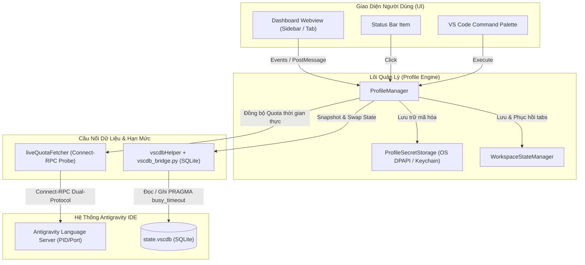

<p align="center">
  
</p>

<h1 align="center">Antigravity Safe Account Manager & Dashboard</h1>

<p align="center">
  <b>Extension quản lý đa tài khoản Google AI, tự động luân chuyển phiên làm việc khi cạn hạn mức, bảo toàn tab mở và con trỏ chuột qua reload, cùng bảng điều khiển giám sát hạn mức thời gian thực cho Antigravity IDE.</b>
</p>

<p align="center">
  
  
  
  
</p>

---

## 🌟 Điểm Nổi Bật (Key Features)

### 1. ⚡ Luân Chuyển Nhanh Kèm Bảo Toàn Không Gian Làm Việc (Fast Swap & Workspace Preservation)
- Cập nhật chứng thực tài khoản an toàn qua SQLite `state.vscdb` và SecretStorage.
- Tự động phát hiện và lưu các tài liệu chưa lưu (`hasDirtyDocuments`), ghi nhớ toàn bộ tab đang mở, view column và vị trí con trỏ chuột (`workspaceState.js`).
- Thực hiện làm mới cửa sổ (`reloadWindow`) có bảo toàn trạng thái, tự động khôi phục ngữ cảnh làm việc sau khi IDE nạp tài khoản mới.

### 2. 🎨 Giao Diện Dashboard Tối Giản
- Thiết kế tối giản, trực quan, tương phản chuẩn WCAG AA.
- **Bố cục Bento Grid**: Tự động co giãn từ bảng điều khiển Sidebar (1 cột) đến Tab rộng (3 cột).
- **Banner Phím Tắt**: `Ctrl` + `Alt` + `S` (macOS: `Cmd` + `Alt` + `S`) để xoay vòng nhanh sang tài khoản kế tiếp (1 -> 2 -> 3).
- **Stepper HUD Visualizer**: Hiển thị tiến trình trực quan khi đổi tài khoản (`Sao lưu` $\rightarrow$ `Nạp Token` $\rightarrow$ `Làm mới IDE` $\rightarrow$ `Hoàn tất`).
- **Hệ Thống Quota Gauges Đa Mô Hình**: Phân màu trực quan theo thời gian thực (Xanh >15%, Vàng 11-15%, Đỏ ≤10%) cho **Gemini 5h**, **Gemini Weekly** và **Partner Models**.
- Đổi tên gợi nhớ inline (click biểu tượng bút chì) và sao chép email 1-click có tooltip phản hồi.
- Đồng hồ đếm ngược phục hồi quota thời gian thực (`Hồi sau: Xh Ym Zs`) và nhãn thời gian đồng bộ `lastSyncedAt`.

### 3. 🧠 Tự Động Luân Chuyển Khi Cạn Hạn Mức (Smart Auto-Switch)
- Tự động phát hiện khi tài khoản đang hoạt động cạn hạn mức đã biết (Quota $\le 10\%$ hoặc gặp mã lỗi 429). Hạn mức không xác định (`null`) không bao giờ kích hoạt nhầm việc chuyển đổi.
- Thuật toán chấm điểm theo các hạn mức độc lập:
  $$\text{Score} = (\text{5h} \times 0.6) + (\text{Weekly} \times 0.4)$$
- Ưu tiên ứng viên có thời điểm hồi phục hạn mức trong tương lai gần hơn khi điểm số tương đương.

### 4. 🛡️ Lưu Trữ An Toàn Qua OS SecretStorage
- Mã hóa token ở cấp hệ điều hành thông qua **VS Code SecretStorage** (Windows DPAPI / macOS Keychain / Linux SecretService).
- **Quy trình Di Chuyển An Toàn (Verified Migration)**: Bắt buộc đọc lại và xác minh thành công từ SecretStorage trước khi hủy các file token plaintext cũ trên đĩa. Không bao giờ tạo thêm bản sao credential dạng plaintext trong thư mục profile.
- Cấu hình được lưu trữ tại thư mục lưu trữ tiêu chuẩn của hệ điều hành (`globalStorageUri` / standard storage), không sử dụng đường dẫn cứng cục bộ.

### 5. 💾 Bảo Toàn Trạng Thái Workspace (Workspace State Resilience)
- Tự động phát hiện các tài liệu chưa được lưu và kích hoạt `saveAll()` an toàn trước khi nạp lại cửa sổ.
- Ghi nhớ và phục hồi danh sách tab đang mở, view column và vị trí con trỏ chuột.

### 6. 📦 Xuất / Nhập Bundle Cấu Hình (Profiles Bundle)
- Đóng gói cấu hình 3 slot (metadata, tên gợi nhớ, cấu hình quota) vào tệp JSON (`antigravity_profiles_bundle.json`). Bundle không chứa bí mật xác thực/token để đảm bảo an toàn tuyệt đối.
- Xác thực schema tối thiểu trước khi nạp nhằm bảo vệ cấu hình hiện tại không bị lỗi khi import bundle hỏng.

---

## 🏗️ Kiến Trúc Hệ Thống (Architecture)



---

## ⌨️ Phím Tắt & Thao Tác Nhanh

| Phím Tắt | Chức Năng |
| :--- | :--- |
| **`Ctrl + Alt + S`** (macOS: `Cmd + Alt + S`) | **Fast Swap**: Xoay vòng nhanh sang tài khoản kế tiếp (1 $\rightarrow$ 2 $\rightarrow$ 3 $\rightarrow$ 1) |

---

## 📋 Danh Sách Lệnh (Command Palette)

Nhấn `Ctrl + Shift + P` (hoặc `Cmd + Shift + P`) và gõ `Antigravity Account`:

- `Antigravity Account: Open Command Center (Sidebar)` — Mở Dashboard trên thanh Activity Bar bên trái.
- `Antigravity Account: Open Command Center in Full Tab` — Mở Dashboard trên Tab rộng toàn màn hình.
- `Antigravity Account: Switch Profile` — Mở danh sách QuickPick chọn nhanh Slot tài khoản.
- `Antigravity Account: Save Current Session to Profile Slot` — Lưu phiên đăng nhập hiện tại vào Slot mong muốn.
- `Antigravity Account: Fast Swap Next Account (1 -> 2 -> 3)` — Đổi sang tài khoản kế tiếp có quota.
- `Antigravity Account: Export Profiles & Tokens Bundle (JSON)` — Xuất gói cấu hình và token ra file JSON.
- `Antigravity Account: Import Profiles & Tokens Bundle (JSON)` — Nạp gói cấu hình và token từ file JSON máy khác.
- `Antigravity Account: Delete Account / Clear Profile Slot` — Xóa tài khoản và giải phóng Slot về trạng thái trống.
- `Antigravity Account: Backup/Export Profiles` — Sao lưu toàn bộ thư mục Profiles ra thư mục `backups/`.

---

## ⚙️ Cài Đặt & Cấu Hình (Settings)

Extension cung cấp các cài đặt trong `Settings` (`Ctrl + ,` -> gõ `Antigravity Safe Switcher`):

```json
{
  // Tự động đổi sang tài khoản có quota cao nhất khi tài khoản hiện tại <= 10% hoặc gặp 429
  "antigravitySafeSwitcher.autoSwitchOnLowQuota": true,

  // Ngưỡng cảnh báo Quota màu vàng (%)
  "antigravitySafeSwitcher.warningThreshold": 15,

  // Ngưỡng kích hoạt cảnh báo đỏ và tự động chuyển đổi (%)
  "antigravitySafeSwitcher.criticalThreshold": 10,

  // Tự động bảo toàn và khôi phục các tab code và con trỏ chuột
  "antigravitySafeSwitcher.preserveWorkspace": true
}
```

---

## 🧪 Kiểm Thử & Quality Gates

Dự án thiết lập các cổng kiểm thử tự động, phân tách rõ ràng giữa kiểm thử đơn vị độc lập và kiểm tra tích hợp trực tiếp:

```bash
# Kiểm tra kiểu dữ liệu (TypeScript / JSDoc)
npm run typecheck

# Chạy Suite A: Kiểm thử đơn vị cô lập (Deterministic, chạy độc lập, không cần IDE)
npm test

# Chạy Suite B: Kiểm tra tích hợp trực tiếp (Yêu cầu Antigravity IDE và Language Server đang chạy)
npm run test:live

# Chạy toàn bộ cả 2 suites
npm run test:all

# Kiểm tra tính hợp lệ của manifest đóng gói
npm run check-package
```

---

## 📦 Đóng Gói Tiện Ích Mở Rộng (.VSIX)

Để đóng gói extension thành file cài đặt `.vsix`:

```bash
# Đóng gói với vsce
npm run package
```

Sau khi hoàn tất, bạn có thể cài đặt trực tiếp vào Antigravity IDE:
- Mở Antigravity IDE $\rightarrow$ Vào tab **Extensions** (`Ctrl + Shift + X`) $\rightarrow$ Click vào menu `...` ở góc trên $\rightarrow$ Chọn **Install from VSIX...** $\rightarrow$ Chọn file `.vsix` vừa tạo.

---

## 🔒 Bảo Mật & Quyền Riêng Tư (Security & Privacy)

- **Cục bộ & Không gửi dữ liệu ngoài**: Extension hoạt động hoàn toàn cục bộ trên máy tính của bạn. Không thu thập telemetry, không gửi dữ liệu ra bất kỳ máy chủ bên thứ ba nào.
- **Lưu trữ qua VS Code SecretStorage**: Mọi Access Token, Refresh Token được quản lý qua API SecretStorage của VS Code để hệ điều hành mã hóa.
- **Tương tác SQLite an toàn**: Dữ liệu SQLite được tương tác với cơ chế `busy_timeout` để tránh gây xung đột khóa tệp khi IDE đang hoạt động.

---

## 📄 Bản Quyền (License)

Phát hành dưới giấy phép [MIT License](LICENSE). Bản quyền thuộc về © 2026 Tan Nguyen & Antigravity Engineering.
