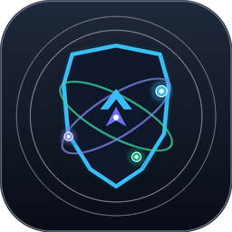
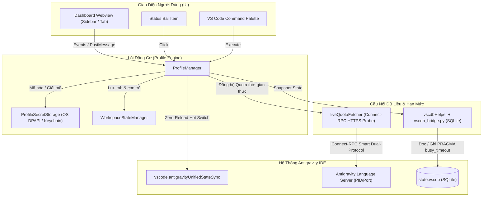

<p align="center">
  
</p>

<h1 align="center">Antigravity Safe Account Manager & Dashboard</h1>

<p align="center">
  <b>Extension quản lý đa tài khoản Google AI, luân chuyển tức thì (Zero-Reload Hot Switch), tự động xoay tua thông minh khi cạn quota và bảng điều khiển Token Analytics chuẩn Linear / Raycast Studio cho Antigravity IDE.</b>
</p>

<p align="center">
  
  
  
  
  
</p>

---

## 🌟 Điểm Nổi Bật (Key Features)

### 1. ⚡ Zero-Reload Hot Switch (Chuyển Đổi Trong 1 Giây)
- Đổi tài khoản Google AI đang liên kết trực tiếp trong bộ nhớ thông qua `vscode.antigravityUnifiedStateSync.OAuthPreferences` và SQLite State Snapshot.
- **Hoàn toàn không cần reload window**, giữ nguyên toàn bộ ngữ cảnh lập trình, terminal đang chạy và các file đang mở.

### 2. 🎨 Giao Diện Studio Đẳng Cấp (`/design-taste-frontend`)
- Thiết kế theo phong cách **Linear / Raycast / Vercel Studio**: Tối giản, sang trọng, tương phản chuẩn WCAG AA.
- **Bố cục Bento Grid**: Tự động co giãn mượt mà từ bảng điều khiển Sidebar hẹp (1 cột) đến Tab rộng (3 cột).
- **Banner Phím Tắt Xúc Giác (Tactile Keycap)**: `Ctrl` + `Alt` + `S` kèm nút bấm *Đổi tài khoản kế tiếp (Fast Swap)* trực quan.
- **Stepper HUD Visualizer**: Hiển thị thanh tiến trình 4 giai đoạn thời gian thực khi chuyển đổi (`Sao lưu` $\rightarrow$ `Nạp Token` $\rightarrow$ `Khởi động LS` $\rightarrow$ `Xác thực`).
- **Hệ Thống Quota Gauges Đa Mô Hình**: Phân chia màu sắc thông minh theo thời gian thực (Xanh lục >30%, Vàng 11-30%, Đỏ ≤10%) cho **Gemini Flash**, **Gemini Pro** và **Claude 3.7 Sonnet**.
- Đổi tên gợi nhớ inline (ví dụ: *AI Công Việc*, *AI Cá Nhân*) và sao chép email 1-click có tooltip phản hồi.
- Đồng hồ đếm ngược phục hồi quota thời gian thực (`Hồi sau: Xh Ym Zs`).

### 3. 🧠 Smart Auto-Switch & Anti-Flapping Hysteresis
- Tự động phát hiện khi tài khoản đang hoạt động cạn hạn mức (Quota $\le 10\%$ hoặc gặp mã lỗi 429).
- Thuật toán chấm điểm tối ưu:
  $$\text{Score} = (\text{Flash} \times 0.55) + (\text{Pro} \times 0.35) + (\text{Claude} \times 0.10)$$
- **Ngưỡng an toàn Hysteresis (+15 điểm)**: Chỉ kích hoạt chuyển đổi khi tài khoản ứng viên vượt trội ít nhất 15 điểm so với tài khoản hiện tại, loại bỏ hoàn toàn hiện tượng đảo slot liên tục khi quota xấp xỉ nhau.

### 4. 🛡️ Bảo Mật Tuyệt Đối & Zero Data Loss
- Mã hóa token ở cấp hệ điều hành thông qua **VS Code SecretStorage** (Windows DPAPI / macOS Keychain / Linux SecretService).
- **Quy trình Di Chuyển An Toàn (Verified Migration)**: Bắt buộc đọc lại và xác minh thành công trước khi hủy bất kỳ file plaintext nào trên ổ đĩa. Nếu chạy ngoài môi trường VS Code, file đĩa được bảo lưu 100%.
- Cơ chế lưu trữ cách ly trên ổ đĩa `D:\Projects\antigravity-account-switcher\profiles` tránh việc các phần mềm diệt virus (Avast, Windows Defender) quét nhầm hay xóa nhầm file dữ liệu.

### 5. 💾 Bảo Toàn Tình Trạng Workspace (Workspace State Resilience)
- Tự động phát hiện các tài liệu chưa được lưu (`hasDirtyDocuments`) và kích hoạt `saveAll()` an toàn trước khi nạp lại cửa sổ nếu có yêu cầu.
- Ghi nhớ và phục hồi chính xác danh sách tab đang mở, view column và vị trí con trỏ chuột.

### 6. 📦 Xuất / Nhập Bundle Đa Thiết Bị (Multi-Device Bundle)
- Đóng gói toàn bộ cấu hình 3 slot cùng token mã hóa thành 1 tệp JSON duy nhất (`antigravity_profiles_bundle.json`).
- Nạp cấu hình sang máy tính hoặc môi trường làm việc mới chỉ trong 1 giây qua Command Palette.

---

## 🏗️ Kiến Trúc Hệ Thống (Architecture)



---

## ⌨️ Phím Tắt & Thao Tác Nhanh

| Phím Tắt | Chức Năng |
| :--- | :--- |
| **`Ctrl + Alt + S`** (macOS: `Cmd + Alt + S`) | **Fast Swap**: Xoay vòng nhanh sang tài khoản kế tiếp (1 $\rightarrow$ 2 $\rightarrow$ 3 $\rightarrow$ 1) |

---

## 📋 Danh Sách Lệnh (Command Palette)

Nhấn `Ctrl + Shift + P` (hoặc `Cmd + Shift + P`) và gõ `Antigravity Account`:

- `Antigravity Account: Open Command Center (Sidebar)` — Mở Dashboard trên thanh Activity Bar bên trái.
- `Antigravity Account: Open Command Center in Full Tab` — Mở Dashboard trên Tab rộng toàn màn hình.
- `Antigravity Account: Switch Profile` — Mở danh sách QuickPick chọn nhanh Slot tài khoản.
- `Antigravity Account: Save Current Session to Profile Slot` — Lưu phiên đăng nhập hiện tại vào Slot mong muốn.
- `Antigravity Account: Fast Swap Next Account (1 -> 2 -> 3)` — Đổi sang tài khoản kế tiếp có quota.
- `Antigravity Account: Export Profiles & Tokens Bundle (JSON)` — Xuất gói cấu hình và token ra file JSON an toàn.
- `Antigravity Account: Import Profiles & Tokens Bundle (JSON)` — Nạp gói cấu hình và token từ file JSON máy khác.
- `Antigravity Account: Delete Account / Clear Profile Slot` — Xóa tài khoản và giải phóng Slot về trạng thái trống.
- `Antigravity Account: Backup/Export Profiles to Drive D` — Sao lưu toàn bộ thư mục Profiles ra thư mục `backups/`.

---

## ⚙️ Cài Đặt & Cấu Hình (Settings)

Extension cung cấp các cài đặt linh hoạt trong `Settings` (`Ctrl + ,` -> gõ `Antigravity Safe Switcher`):

```json
{
  // Tự động đổi sang tài khoản có quota cao nhất khi tài khoản hiện tại <= 10% hoặc gặp 429
  "antigravitySafeSwitcher.autoSwitchOnLowQuota": true,

  // Ngưỡng cảnh báo Quota màu vàng (%)
  "antigravitySafeSwitcher.warningThreshold": 15,

  // Ngưỡng kích hoạt cảnh báo đỏ và tự động chuyển đổi (%)
  "antigravitySafeSwitcher.criticalThreshold": 10,

  // Tự động bảo toàn và khôi phục các tab code và con trỏ chuột
  "antigravitySafeSwitcher.preserveWorkspace": true
}
```

---

## 🧪 Kiểm Thử Tự Động (Test Suite)

Dự án đi kèm bộ kiểm thử tự động toàn diện kiểm tra 15 nhóm tính năng với **53 ca kiểm thử (53/53 PASS)**:

```bash
# Chạy bộ test toàn diện
npm test
# Hoặc
node test/live_runner.js
```

Kết quả kiểm thử:
- **Suite A (Unit & Logic Cô lập)**: 47/47 PASSED (Zero side effects, mocked secrets, dry run).
- **Suite B (Live Integration Probes)**: 6/6 PASSED (Kết nối thật Language Server Connect-RPC, SQLite Bridge non-destructive export).

---

## 📦 Đóng Gói Tiện Ích Mở Rộng (.VSIX)

Để đóng gói extension thành file cài đặt `.vsix`:

```bash
# Đóng gói với vsce
npx @vscode/vsce package --no-dependencies
```

Sau khi hoàn tất, bạn có thể cài đặt trực tiếp vào Antigravity IDE:
- Mở Antigravity IDE $\rightarrow$ Vào tab **Extensions** (`Ctrl + Shift + X`) $\rightarrow$ Click vào menu `...` ở góc trên $\rightarrow$ Chọn **Install from VSIX...** $\rightarrow$ Chọn file `antigravity-safe-account-manager-1.2.0.vsix`.

---

## 🔒 Cam Kết Bảo Mật & Quyền Riêng Tư (Security & Privacy)

- **100% Offline & Local**: Extension hoạt động hoàn toàn cục bộ trên máy tính của bạn. Không thu thập telemetry, không gửi dữ liệu ra bất kỳ máy chủ bên thứ ba nào.
- **Mã Hóa OS SecretStorage**: Mọi Access Token, Refresh Token đều được bảo vệ bởi lớp mã hóa an toàn của hệ điều hành.
- **Không Xâm Hại Hệ Thống**: Dữ liệu SQLite được tương tác an toàn qua cơ chế `busy_timeout` và snapshot có sao lưu phòng ngừa sự cố.

---

## 📄 Bản Quyền (License)

Phát hành dưới giấy phép [MIT License](LICENSE). Bản quyền thuộc về © 2026 Tan Nguyen & Antigravity Engineering.
